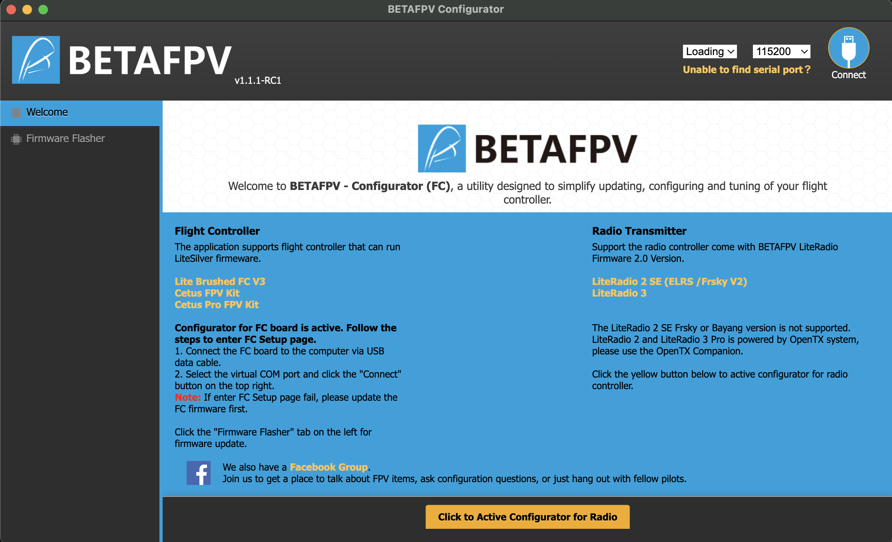

# BETAFPV Configurator

## Developers
- 安装**Visual Studio Code** ：[https://code.visualstudio.com/](https://code.visualstudio.com/ "here")
- 安装**node.js**：https://nodejs.org/en/download/
- 安装**nvm**：[https://github.com/coreybutler/nvm-windows/releases](https://github.com/coreybutler/nvm-windows/releases "here")(nvm-setup.zip)
- 克隆项目到本地：`git clone git@github.com:BETAFPV/BETAFPV_Configurator.git`
- 通过VS Code打开项目文件夹，在VS Code的菜单栏的Terminal新建终端并输入以下命令：
```
#安装Node虚拟机
nvm install 16.20.0     
nvm use 16.20.0 
#加载所有的关联包
npm install
npm install --save-dev electron-rebuild
./node_modules/.bin/electron-rebuild

# If you have trouble on Windows, try:
.\node_modules\.bin\electron-rebuild.cmd


#启动electron程序
electron .


若在VS Code输入命令时出现以下错误：无法加载文件xxx.ps1，因为在此系统中禁止脚本。 解决方案如下：
- 按下Window+R，输入**powershell**，回车或确定。
- 输入**Set-Executionpolicy remotesigned**,回车。
- 输入**y**回车。
```

## 2024/3/29 

```shell
% node -v
v20.11.0
% npm -v
10.2.4
% yarn -v
1.22.21
```

・npm -> yarn
```shell
# npm install
yarn
```

・run app on mac
```shell
npx electron-packager . BETAFPV_Configurator --platform=darwin --arch=x64 --out=./Mac --app-version=1.1.1 --overwrite --icon=./BETAFPV_LOGO.icns

open Mac/BETAFPV_Configurator-darwin-x64

# double click app file!!
```



・add formatter
```shell
yarn fmt
```
